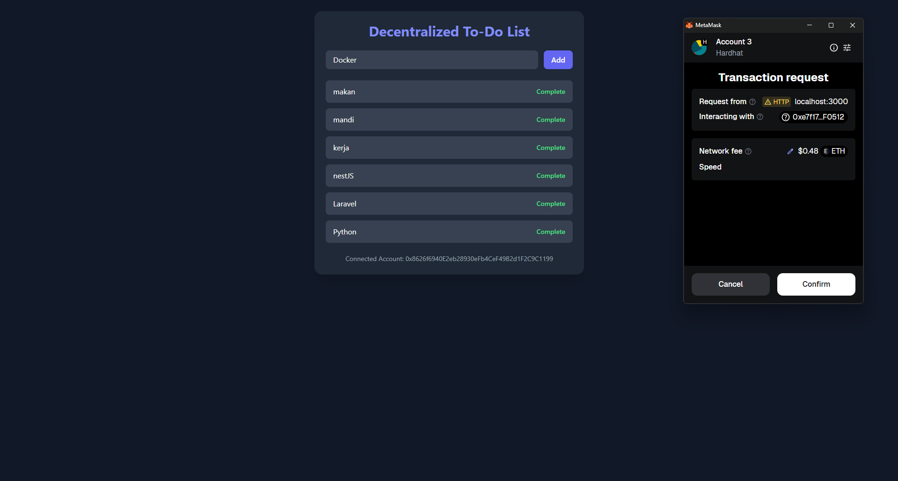

# 🧾 Decentralized To-Do List (Web3 DApp)

This is a simple yet powerful decentralized To-Do List built with:

- **Solidity** for smart contracts
- **Hardhat** for local Ethereum development
- **React** for the frontend
- **TailwindCSS** for elegant styling
- **MetaMask** for Ethereum wallet interaction

Every task you add is saved on the Ethereum blockchain.

---

## 🚀 Features

- Add and view blockchain-based tasks
- MetaMask wallet connection
- Elegant UI with Tailwind CSS
- Local blockchain simulation with Hardhat
- Smart contract deployment
- Role-based access (only task creator can delete)

---

## 📂 Project Structure

todo-dapp/
├── contracts/
│ └── TodoList.sol # Solidity Smart Contract
├── scripts/
│ └── deploy.js # Deployment script
├── frontend/
│ ├── public/
│ ├── src/
│ │ ├── App.js # Main React App
│ │ ├── TodoList.json # ABI from artifacts
│ │ └── ... # Other components
│ ├── tailwind.config.js
│ └── postcss.config.js
└── hardhat.config.js

---

## 🛠 Installation & Setup

### 1. Clone the repository

git clone https://github.com/FaradiansyahRokan/Decentralized-To-Do-List-Web3-App.git

cd todo-dapp
### 2. Install Hardhat & Dependencies

npm install --save-dev hardhat

npm install @nomicfoundation/hardhat-toolbox

### 3. Compile Smart Contract
npx hardhat compile
### 4. Start Hardhat Local Node

npx hardhat node 

#⚠️ Keep this terminal running

### 5. Deploy Smart Contract to Local Network
Open new terminal and run:

npx hardhat run scripts/deploy.js --network localhost

## 💻 Frontend Setup
Go into frontend folder:

cd frontend

npm install

### 6. Install TailwindCSS

npm install -D tailwindcss postcss autoprefixer

npx tailwindcss init -p

### 7. Configure Tailwind in tailwind.config.js

content: [
  "./src/**/*.{js,jsx,ts,tsx}",
],
theme: {
  extend: {},
},
plugins: [],

### 8. Add Tailwind to index.css

@tailwind base;
@tailwind components;
@tailwind utilities;

### 9. Copy ABI File
From root directory:

cp ./artifacts/contracts/TodoList.sol/TodoList.json ./frontend/src/

### 10. Start React App
npm start

## 🦊 Connect MetaMask
Open MetaMask

Click “Add Network” → Custom RPC

Add the following:

Network Name: Localhost 8545

New RPC URL: http://127.0.0.1:8545

Chain ID: 31337

Currency Symbol: ETH

Import an account from Hardhat (use private key shown in npx hardhat node)

Ensure you’re connected to this new localhost network

## ⚙️ Usage
Type a task and click “Add Task”

It’ll be saved to the blockchain

Only the task creator can delete the task

Refreshing will still display tasks if local blockchain is still running

## 📦 Build for Production

npm run build

## 🧠 Tech Stack
Solidity
Hardhat
ReactJS
TailwindCSS
MetaMask
Ethers.js

🔐 Notes
Tasks will not persist if the local blockchain (npx hardhat node) is restarted unless re-deployed

For persistent storage, consider deploying to testnet (e.g., Sepolia or Goerli) and use Infura/Alchemy

📸 Screenshot

✨ License
MIT © Rokan Subhi Faradiansyah

---

